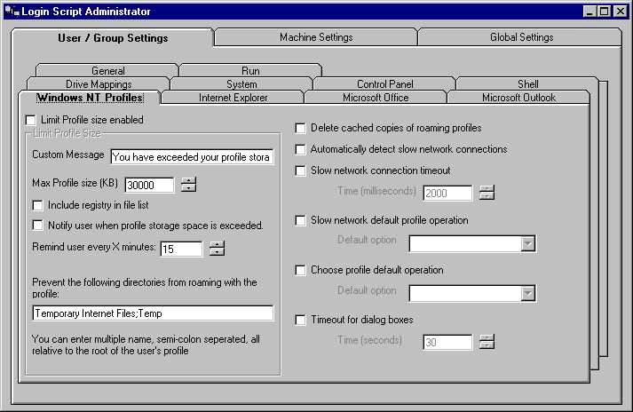



## Login Script GUI

### Description

This program allows Administrators of a Windows 2000/NT Domain to Setup & Configure Login Scripts from a GUI interface. They can configure IE, Office, Outlook, Windows NT Profiles, and more. All from an easy to use interface. When the user logs in they also get a GUI. So they know what is happening to there computers. No more Black windows... If you like,it, please vote... Thanks
 
### More Info
 

             |
---                |---
**Submitted On**   |2000-11-14 07:16:48
**By**             |[David West](https://github.com/Planet-Source-Code/PSCIndex/blob/master/ByAuthor/david-west.md)
**Level**          |Advanced
**User Rating**    |4.8 (24 globes from 5 users)
**Compatibility**  |VB 6\.0
**Category**       |[Complete Applications](https://github.com/Planet-Source-Code/PSCIndex/blob/master/ByCategory/complete-applications__1-27.md)
**World**          |[Visual Basic](https://github.com/Planet-Source-Code/PSCIndex/blob/master/ByWorld/visual-basic.md)
**Archive File**   |[CODE\_UPLOAD1167511142000\.zip](https://github.com/Planet-Source-Code/david-west-login-script-gui__1-12781/archive/master.zip)

